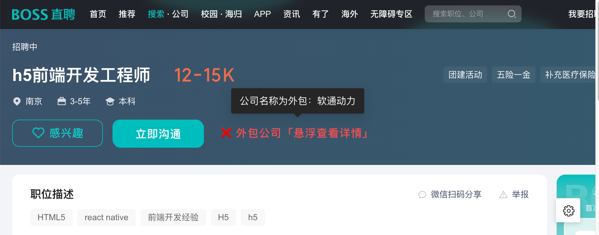
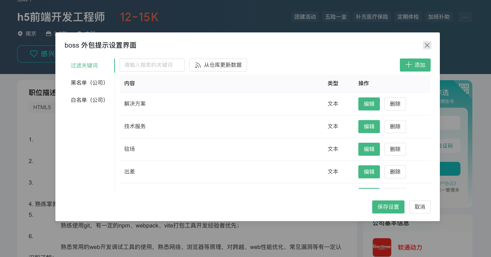

# BOSS 直聘外包提示

程序员界一直流传各种对外包的歧视，但是很多外包公司在投递简历的时候还需要自己来手动筛选过于麻烦，就有了这个小工具。

> 使用需要结合油猴插件使用

## 使用方式

- 方法一：[点击安装](https://greasyfork.org/zh-CN/scripts/478865-boss%E5%A4%96%E5%8C%85%E5%85%AC%E5%8F%B8%E6%8F%90%E7%A4%BA)

- 方法二：自行添加油猴插件，点击 Releases 查看构建后的代码，或者 dist 目录下复制脚本。

## 判定规则

1. 采用黑名单 + 关键词的机制，如果公司名称出现在黑名单上则直接判定为黑名单，或者关键词出现三次及以上也会认定为外包公司；
2. 如果不符合规则 1，但是出现了关键词会被判定可能为外包，进行提示。

### 规则收集参考

- https://www.zhihu.com/question/32123407
- https://zhuanlan.zhihu.com/p/407777028
- https://www.zvsts.com/article/news/1/4e347ffffe83fd932bcbbf4efafb0000.html

> 如果你有好的个规则补充，可以在 [issues](https://github.com/bosens-China/boss-outsourcing-tips/issues) 进行交流。

### 规则更新

为了方便管理，新增了本地自定义以及仓库更新功能，关键词支持正则以及文本定义两种形式。

## 协议

MIT License
